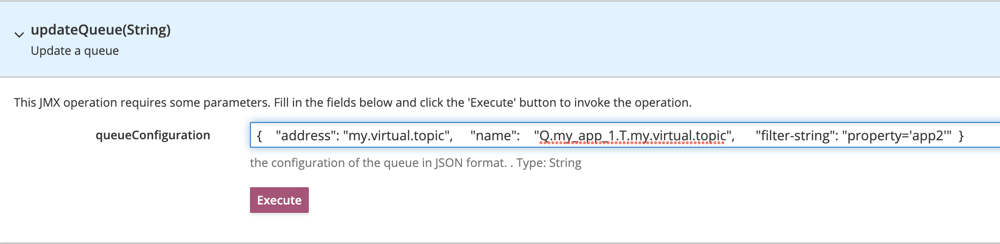

= Virtual Topics

AMQ6 and Openwire had a _Virtual Topic_ pattern, that was adopted by AMQ7 for compatibility reasons. Optionally it's also possible to apply _Filter_ expressions on the queues when the address/queue structure is auto-created by the clients. To achieve this the broker _acceptor_ must have the `virtualTopicConsumerWildcards` Openwire parameter with a naming pattern. 

For example having `virtualTopicConsumerWildcards=Q.*.>;3;selectorAware=true` in broker config and a consumer code like:
```
Queue queue = session.createQueue("Q.my_app_1.T.my.virtual.topic");
session.createConsumer(queue, "property='app1'");
```

would auto-create an address/queue structure - with the consumer connected - like this:
```
broker
└── my.virtual.topic
    └── multicast
        └── Q.my_app_1.T.my.virtual.topic (with filter: property='app1')
```

Using the AMQP or CORE protocol we have two options to achieve similar structure:

* Using _Fully Qualified Queue Name_ (FQQN)
* Using _JMS 2.0 Shared Subscription_

== Fully Qualified Queue Name

Use FQQNs (`address_name::queue_name`) in _Topic_ subscription (so it creates a `multicast` address). Optionally the consumer can have a _selector_ expression that will be added to the created queue as Filter expression.

Consumer code:
```
Topic topic = session.createTopic("my.virtual.topic::Q.my_app_1.T.my.virtual.topic");
session.createConsumer(topic, "property='app1'");
```

Auto-created address/queue:
```
broker
└── my.virtual.topic
    └── multicast
        └── Q.my_app_1.T.my.virtual.topic (with filter: property='app1')
```

Note:

* The Filter expression is only added to the created queue since _Apache Artemis v2.29.0_. Earlier broker versions create the queue, but without any Filter expression, which means all messages sent to the address will be routed to the queue. 
* With CORE protocol it's also necessary to use `artemis-jms-client.jar` v2.29+ to make the Filter expressions work.
* Once the queue is created with a Filter expression, any consumer trying to connect using a different - non-empty - _selector_ expression will be rejected.

The Filter expression on existing queues can be updated manually via the web-console calling the `updateQueue(String)` operation with a JSON like:
```
{ 
  "address": "my.virtual.topic",  
  "name":    "Q.my_app_1.T.my.virtual.topic",   
  "filter-string": "property='app2'" 
}
```



We need to make sure that consumer clients are also restarted with a new _selector_ afterwards, otherwise they will receive no messages.

*Pros/Cons of using Fully Qualified Queue Name*

* Pros
** Address/Queue names can be exactly the same as with Openwire protocol, so client apps can connect to existing Virtual Topics after changing protocol.
* Cons:
** Filter expressions on auto-created queues require broker v2.29+
** Filter expressions can't be updated by a consumer using a different _selector_, need manual update.
** Using FQQN is an Apache Artemis specific solution

== JMS 2.0 Shared Subscription

JMS 2.0 Shared Subscriptions can also be used to achieve queue structure like Virtual Topics, but the queue naming convention has some limitations:

Consumer code:
```
Topic topic = session.createTopic("my.virtual.topic");
session.createSharedDurableConsumer(topic, "Q.my_app_1.T.my.virtual.topic", "property='app1'");
```

Auto-created queue with AMQP protocol:
```
broker
└── my.virtual.topic
    └── multicast
        └── Q.my_app_1.T.my.virtual.topic:global (with filter: property='app1')
```

Auto-created queue with CORE protocol:
```
broker
└── my.virtual.topic
    └── multicast
        └── Q\\.my_app_1\\.T\\.my\\.virtual\\.topic (with filter: property='app1')
```

Note:

* With AMQP protocol the broker adds `:global` suffix to queue name
* With CORE protocol the broker escapes `.` to `\\.` in queue name.
** Optionally can enable `amqpUseCoreSubscriptionNaming=true` in `brokerProperties` to see the same queue name with AMQP like with CORE. 
** This is a good solution to achieve same queue names as with Openwire if no `.` is used in queue names.
* Filter expressions can be updated by a consumer connecting with a different _selector_ (e.g. `property='app2'`).
** To achieve an update no other consumers can be connected to the queue, as no active consumers are allowed with different Filter expressions on a queue. This practically requires `strategy.type: Recreate` for client apps with multi-replica _Deployments_

*Pros/Cons of using JMS 2.0 Shared Subscription*

* Pros
** Filter expressions works with Apache Artemis earlier than v2.29
** Filter expression can be updated by a consumer using a different _selector_
** Shared Subscription is a standard JMS 2.0 feature
* Cons
** Generally - with queue names having `.` - we can't have the exact same queue names as with Openwire, which means apps may not be able to connect to the existing Virtual Topic queues
